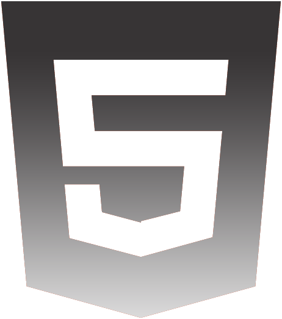

  

<h1 align="center">Welcome, I'm Adrián Machado   </h1>

 

 The path I followed to train in the different knowledge was as a result of a web design course, where it awakened the passion for technology. Currently, I am studying the career in programming.

I have done different projects, using HTML, CSS, JavaScript, Angular.

Currently, I'm learning Astro Framework .

I had the opportunity to work in the IT sector and got my first work experience

# 💻 Tech Stack:

#💻 New knowledge in process:

 
 

# 📊 GitHub Stats:
 
 

---

# ℹ Contact

<!--
**adrianmachadodev/adrianmachadodev** is a ✨ _special_ ✨ repository because its `README.md` (this file) appears on your GitHub profile.

Here are some ideas to get you started:

- 🔭 I’m currently working on ...
- 🌱 I’m currently learning ...
- 👯 I’m looking to collaborate on ...
- 🤔 I’m looking for help with ...
- 💬 Ask me about ...
- 📫 How to reach me: ...
- 😄 Pronouns: ...
- ⚡ Fun fact: ...
-->
